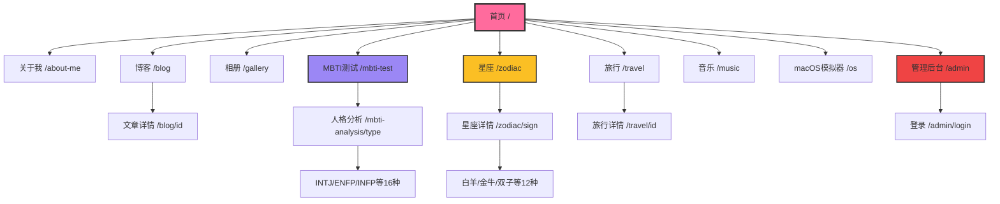

# Clock-NextJS 站点地图 (Sitemap)

**项目**: Yoru Personal Portfolio
**URL**: https://clock-nextjs.vercel.app
**日期**: 2026-01-15

---

## 可视化层级结构

```
首页 (Home)
│
├─── 关于我 (About Me)
│    └─── /about-me
│
├─── 博客系统 (Blog)
│    ├─── /blog - 博客列表
│    └─── /blog/[id] - 文章详情页
│
├─── 相册 (Gallery)
│    └─── /gallery - 照片网格/地图视图
│
├─── MBTI 人格测试 (MBTI Test)
│    ├─── /mbti-test - 测试界面
│    └─── /mbti-analysis/[type] - 16种人格分析页
│         ├─── /mbti-analysis/INTJ
│         ├─── /mbti-analysis/ENFP
│         ├─── /mbti-analysis/INFP
│         └─── ... (共16种类型)
│
├─── 星座系统 (Zodiac)
│    ├─── /zodiac - 交互式星座轮盘
│    └─── /zodiac/[sign] - 12星座详情页
│         ├─── /zodiac/aries (白羊座)
│         ├─── /zodiac/taurus (金牛座)
│         ├─── /zodiac/gemini (双子座)
│         └─── ... (共12星座)
│
├─── 旅行记录 (Travel)
│    ├─── /travel - 旅行时间线+地图
│    └─── /travel/[id] - 单次旅行详情
│
├─── 音乐播放器 (Music)
│    └─── /music - 音乐库+歌词显示
│
├─── macOS 模拟器 (Desktop OS)
│    └─── /os - 完整桌面环境
│
└─── 管理后台 (Admin)
     ├─── /admin - 内容管理仪表板
     └─── /admin/login - OAuth 登录页
```

---

## Mermaid 流程图



---

## 页面详细说明

### 第一层 (Level 1) - 主导航页面

| 页面 | 路径 | 描述 | 功能 |
|------|------|------|------|
| **首页** | `/` | 动画表情符号背景的落地页 | 品牌展示、导航入口 |
| **关于我** | `/about-me` | 个人介绍页面 | 展示个人信息 |
| **博客列表** | `/blog` | 所有博客文章列表 | Markdown 文章管理 |
| **相册** | `/gallery` | 照片展示（网格/地图切换） | 照片浏览、地理定位 |
| **MBTI测试** | `/mbti-test` | 人格测试界面 | 20题测试、结果计算 |
| **星座轮盘** | `/zodiac` | 交互式12星座轮盘 | 鼠标跟随粒子效果 |
| **旅行** | `/travel` | 旅行时间线+世界地图 | 旅行记录展示 |
| **音乐** | `/music` | 音乐播放器 | 播放/暂停/歌词显示 |
| **macOS模拟器** | `/os` | 桌面操作系统模拟 | 窗口管理、Launchpad |
| **管理后台** | `/admin` | 内容管理仪表板 | 博客/照片/音乐管理 |

### 第二层 (Level 2) - 子页面

| 父页面 | 子页面 | 路径 | 描述 |
|--------|--------|------|------|
| **博客** | 文章详情 | `/blog/[id]` | 单篇 Markdown 文章阅读 |
| **MBTI测试** | 人格分析 | `/mbti-analysis/[type]` | 16种人格类型详细分析 (INTJ, ENFP等) |
| **星座** | 星座详情 | `/zodiac/[sign]` | 12星座完整分析 (白羊、金牛等) |
| **旅行** | 旅行详情 | `/travel/[id]` | 单次旅行的照片和描述 |
| **管理后台** | 登录页 | `/admin/login` | OAuth 认证 (GitHub/Google) |

---

## 用户流程 (User Flows)

### 流程 1: MBTI 测试完整体验
```
首页 → MBTI测试页 → 完成20题 → 获得结果 (如 INFP-T) → 查看详细分析页
```

### 流程 2: 星座探索
```
首页 → 星座轮盘 → 悬停查看星座动画 → 点击星座 → 查看详细分析
```

### 流程 3: 照片浏览
```
首页 → 相册 → 切换网格/地图视图 → 点击照片 → Lightbox 全屏查看
```

### 流程 4: 内容管理
```
管理后台登录 → OAuth 认证 → 多标签仪表板 → 上传博客/照片/音乐
```

---

## 技术架构

- **路由**: Next.js 16 App Router (文件系统路由)
- **动态路由**: `[id]`, `[type]`, `[sign]` 参数
- **数据源**:
  - Supabase (博客、相册、旅行、音乐)
  - 静态数据 (MBTI分析、星座信息)
- **认证**: Supabase Auth (OAuth)

---

## 注意事项

1. **静态页面**: MBTI 分析和星座详情页使用静态数据，无需数据库查询
2. **动态路由**: 博客、旅行详情使用动态路由 `[id]` 从数据库获取
3. **权限控制**: `/admin` 路径需要管理员权限 (邮箱白名单)
4. **响应式设计**: 所有页面支持移动端和桌面端
5. **PWA**: 支持渐进式 Web 应用功能

---

**文档生成日期**: 2026-01-15
**适用于**: INFO 6150 课程站点地图作业
